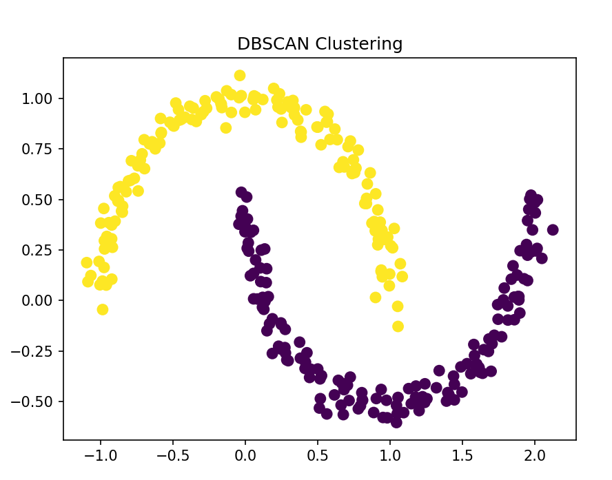
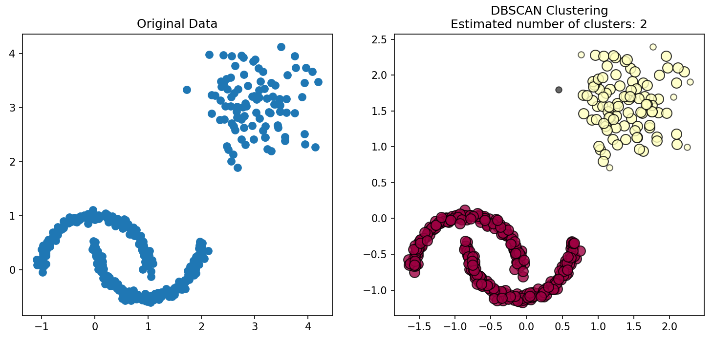
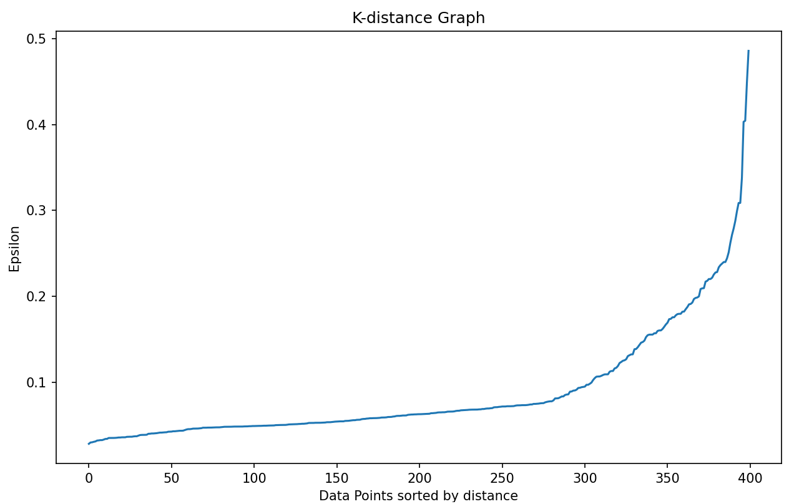
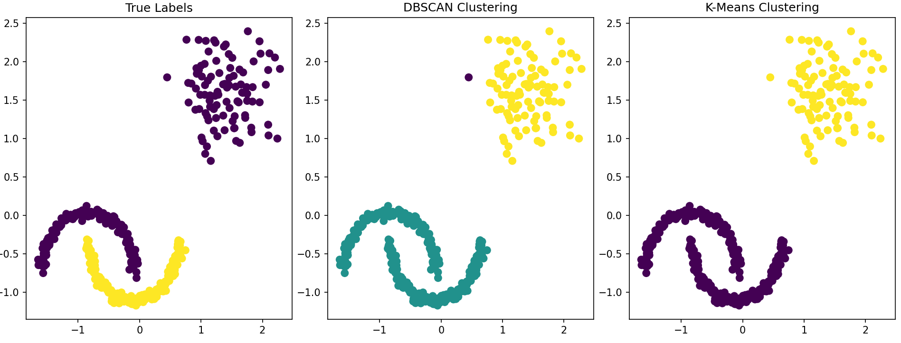

# DBSCAN Clustering Implementation

## Overview

This project demonstrates the implementation of DBSCAN (Density-Based Spatial Clustering of Applications with Noise) clustering algorithm using Python's scikit-learn library. DBSCAN is particularly useful for identifying clusters of arbitrary shapes and detecting outliers in data.

## Features

- Basic DBSCAN implementation on moon-shaped data
- Advanced DBSCAN with mixed dataset (moons + blobs)
- Parameter optimization using k-distance graphs
- Performance evaluation metrics
- Comparison with K-Means clustering
- Comprehensive visualization of results

## Requirements

```bash
pip install numpy scikit-learn matplotlib
```

## Code Structure

### 1. Basic DBSCAN Implementation

```python
import numpy as np
from sklearn.cluster import DBSCAN
from sklearn.datasets import make_moons
import matplotlib.pyplot as plt

# Generate sample data
X, _ = make_moons(n_samples=300, noise=0.05, random_state=0)

# Apply DBSCAN
dbscan = DBSCAN(eps=0.3, min_samples=5)
labels = dbscan.fit_predict(X)

# Visualize results
plt.scatter(X[:, 0], X[:, 1], c=labels, cmap='viridis', s=50)
plt.title("DBSCAN Clustering")
plt.show()

print("Number of clusters:", len(set(labels)) - (1 if -1 in labels else 0))
print("Number of noise points:", list(labels).count(-1))

```
<p align="center">
    
</p>

### 2. Advanced DBSCAN with Mixed Dataset
#### 2.1 Generate Mixed Dataset
```python
from sklearn.datasets import make_moons, make_blobs
from sklearn.preprocessing import StandardScaler
from sklearn import metrics

# Generate sample data
X1, y1 = make_moons(n_samples=300, noise=0.05, random_state=0)
X2, y2 = make_blobs(n_samples=100, centers=[[3, 3]], cluster_std=0.5, random_state=0)
X = np.vstack([X1, X2])
y_true = np.hstack([y1, y2]) 
# Scale the data
scaler = StandardScaler()
X_scaled = scaler.fit_transform(X)

# Apply DBSCAN
dbscan = DBSCAN(eps=0.3, min_samples=5)
labels = dbscan.fit_predict(X_scaled)
```

#### 2.2 Cluster Analysis and Visualization

```python
# Get cluster information
core_samples_mask = np.zeros_like(labels, dtype=bool)
core_samples_mask[dbscan.core_sample_indices_] = True
n_clusters = len(set(labels)) - (1 if -1 in labels else 0)
n_noise = list(labels).count(-1)

print('Estimated number of clusters: %d' % n_clusters)
print('Estimated number of noise points: %d' % n_noise)

# Visualize the results
unique_labels = set(labels)
colors = [plt.cm.Spectral(each) for each in np.linspace(0, 1, len(unique_labels))]

plt.figure(figsize=(12, 5))

# Plot original data
plt.subplot(1, 2, 1)
plt.scatter(X[:, 0], X[:, 1], s=50)
plt.title("Original Data")

# Plot clustered data
plt.subplot(1, 2, 2)
for k, col in zip(unique_labels, colors):
    if k == -1:
        # Black used for noise
        col = [0, 0, 0, 1]

    class_member_mask = (labels == k)

    # Plot core points
    xy = X_scaled[class_member_mask & core_samples_mask]
    plt.plot(xy[:, 0], xy[:, 1], 'o', markerfacecolor=tuple(col),
             markeredgecolor='k', markersize=10, alpha=0.8)

    # Plot non-core points
    xy = X_scaled[class_member_mask & ~core_samples_mask]
    plt.plot(xy[:, 0], xy[:, 1], 'o', markerfacecolor=tuple(col),
             markeredgecolor='k', markersize=6, alpha=0.6)

plt.title('DBSCAN Clustering\nEstimated number of clusters: %d' % n_clusters)
# \n - newline character to create a subtitle
# %d - placeholder for an integer value
# % n_clusters - String formatting that replaces %d with the value of n_clusters
plt.show()
```
<p align="center">
    
</p>

#### 2.4 Performance Evaluation
1. Advantages and Limitations
**Advantages**:
- Bounded between -1 and +1;
  
- Doesn't require ground truth labels;

- Works well with any distance metric.

**Limitations**:
- Computationally expensive for large datasets;

- Higher scores for convex clusters compared to non-convex ones;

- Not suitable for evaluating density-based clusters like DBSCAN.
```python
## Evaluate clustering performance (if ground truth is available)
if len(set(y_true)) > 1:  # Only if we have true labels
    print("Adjusted Rand Index:", metrics.adjusted_rand_score(y_true, labels))
    print("Silhouette Coefficient:", metrics.silhouette_score(X, labels))

# For datasets without ground truth
print("Silhouette Score:", metrics.silhouette_score(X_scaled, labels))

```

#### 2.5 Parameter Optimization

```python
from sklearn.neighbors import NearestNeighbors

def find_optimal_eps(X, min_samples):
    neighbors = NearestNeighbors(n_neighbors=min_samples)
    neighbors_fit = neighbors.fit(X)
    distances, indices = neighbors_fit.kneighbors(X)
    distances = np.sort(distances[:, min_samples-1], axis=0)
    
    plt.figure(figsize=(10, 6))
    plt.plot(distances)
    plt.title('K-distance Graph')
    plt.xlabel('Data Points sorted by distance')
    plt.ylabel('Epsilon')
    plt.show()
    
    # The "elbow" point is a good candidate for eps
    return distances[int(len(distances)*0.95)] # 95th percentile as suggestion


# Find optimal parameters
min_samples = 5
optimal_eps = find_optimal_eps(X_scaled, min_samples)
print(f"Suggested eps value: {optimal_eps:.3f}")
# Output: Suggested eps value: 0.228
<p align="center">
    
</p>

# Run DBSCAN with suggested parameters
dbscan_optimal = DBSCAN(eps=optimal_eps, min_samples=min_samples)
labels_optimal = dbscan_optimal.fit_predict(X_scaled)
```

#### 2.6 Comparison with K-Means

```python
from sklearn.cluster import KMeans

# Compare with K-Means
kmeans = KMeans(n_clusters=2, random_state=0)
kmeans_labels = kmeans.fit_predict(X_scaled)
plt.figure(figsize=(15, 5))

plt.subplot(1, 3, 1)
plt.scatter(X_scaled[:, 0], X_scaled[:, 1], c=y_true, cmap='viridis', s=50)
plt.title("True Labels")

plt.subplot(1, 3, 2)
plt.scatter(X_scaled[:, 0], X_scaled[:, 1], c=labels, cmap='viridis', s=50)
plt.title("DBSCAN Clustering")

plt.subplot(1, 3, 3)
plt.scatter(X_scaled[:, 0], X_scaled[:, 1], c=kmeans_labels, cmap='viridis', s=50)
plt.title("K-Means Clustering")

plt.tight_layout()
plt.show()
```
<p align="center">
    
</p>

## Key Parameters

### DBSCAN Parameters:
- **eps (ε)**: Maximum distance between two samples for them to be considered neighbors
- **min_samples**: Minimum number of samples in a neighborhood for a point to be a core point

### Default Values:
- `eps=0.3`
- `min_samples=5`

## DBSCAN Concepts

### Point Types:
- **Core Points**: Have at least `min_samples` points within distance `eps`
- **Border Points**: Reachable from core points but don't have enough neighbors
- **Noise Points**: Not core points and not reachable from any core point

### Cluster Properties:
- **Density-based**: Clusters form where points are densely packed
- **Arbitrary shapes**: Can identify non-spherical clusters
- **Noise detection**: Explicitly identifies outliers

## Visualization Features

### 1. Basic Cluster Visualization
- Color-coded clusters using viridis colormap
- Noise points typically shown in black

### 2. Advanced Visualization
- Differentiates between core points and border points
- Core points: Larger markers with transparency
- Border points: Smaller markers with transparency
- Noise points: Black color

### 3. Comparative Visualization
- Side-by-side comparison with K-Means results
- True labels vs DBSCAN vs K-Means

## Performance Metrics

### 1. Silhouette Score
- Measures how similar an object is to its own cluster compared to other clusters
- Range: [-1, 1], higher values indicate better clustering

### 2. Adjusted Rand Index
- Measures similarity between two clusterings
- Adjusted for chance, higher values indicate better agreement

## Optimal Parameter Selection

### K-distance Graph Method:
1. Compute distances to k-nearest neighbors for each point
2. Sort these distances in ascending order
3. Plot the sorted distances
4. Look for the "elbow" point where the distance increases sharply
5. The y-value at this point is a good candidate for eps

### Rule of Thumb:
- `min_samples = 2 * dimensions` (for 2D data, min_samples = 4-5)

## Advantages of DBSCAN

1. **No need to specify number of clusters** - Automatically determines cluster count
2. **Handles arbitrary shapes** - Can find non-spherical clusters
3. **Robust to outliers** - Explicitly identifies noise points
4. **Works with varying densities** - Within reason

## Limitations

1. **Parameter sensitivity** - Results highly depend on eps and min_samples
2. **Difficulty with varying densities** - Struggles when clusters have different densities
3. **Border point assignment** - Can be somewhat arbitrary

## Practical Tips

1. **Standardize data** - Crucial for distance-based algorithms
2. **Use domain knowledge** - Helps in setting appropriate parameter values
3. **Visualize k-distance graph** - Essential for choosing optimal eps
4. **Experiment with parameters** - Try multiple values to find optimal results

## Usage Examples

### Basic Usage:
```python
dbscan = DBSCAN(eps=0.3, min_samples=5)
labels = dbscan.fit_predict(X)
```

### With Parameter Optimization:
```python
optimal_eps = find_optimal_eps(X_scaled, min_samples=5)
dbscan_optimal = DBSCAN(eps=optimal_eps, min_samples=5)
labels_optimal = dbscan_optimal.fit_predict(X_scaled)
```

## Results Interpretation

### Output Metrics:
- Number of clusters found
- Number of noise points identified
- Silhouette score (clustering quality)
- Visual comparison with other algorithms

### Visual Analysis:
- Check if clusters match expected patterns
- Verify noise points are appropriately identified
- Compare with ground truth (if available)

## Applications

1. **Anomaly detection** - Identifying outliers in datasets
2. **Spatial data analysis** - Geographical clustering applications
3. **Image segmentation** - Grouping similar pixels together
4. **Customer segmentation** - Identifying groups with similar behaviors

This implementation provides a comprehensive foundation for understanding and applying DBSCAN clustering to various datasets, with particular emphasis on visualization and parameter optimization techniques.